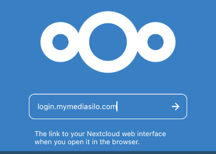
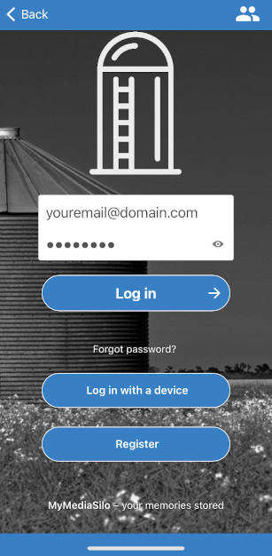
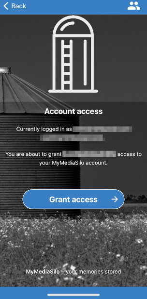
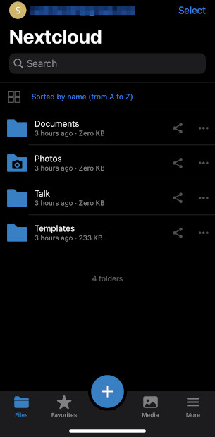

  

<h1 align="center">Welcome to MyMediaSilo.com</h1>
<h2 align="center"><a href="https://login.mymediasilo.com">LOGIN</a></h2>

MyMediaSilo is a self-hosted cloud service that is based on <a href="https://www.nextcloud.com" target="_blank" rel="noopener noreferrer">Nextcloud</a>. Unlike Dropbox, iCloud, Google Drive or Amazon, MyMediaSilo is hosted on a private server, and doesn't suffer any privacy issues. 

### What can you do with MyMediaSilo?
- Securely backup photos and video from your smartphone.
- View files via secure website and smartphone.
- Share photos and video with friends.

## Getting Started
1. First register for an account if you havent already <a href="https://login.mymediasilo.com/apps/registration/" target="_blank" rel="noopener noreferrer">here</a>.
      - **You will be sent a link with a verfication code to verify your account.  The email will come from `mymediasilo@gmail.com` and may end up in your spam folder.**
2. Download the Nextcloud App on your smartphone.  Search for Nextcloud in <a href="https://apps.apple.com/us/app/nextcloud/id1125420102" target="_blank" rel="noopener noreferrer">Apple App Store</a> or <a href="https://play.google.com/store/apps/details?id=com.nextcloud.client&hl=en_US&gl=US" target="_blank" rel="noopener noreferrer">Google Play</a>.  (You don't have to use a smartphone.  There are many Nextcloud clients <a href="https://nextcloud.com/clients/" target="_blank" rel="noopener noreferrer">available</a> or login via the <a href="https://login.mymediasilo.com" target="_blank" rel="noopener noreferrer">web</a>.)  
3. Open the Nextcloud App on your phone that you downloaded from Step 2 and enter in <ins>**login.mymediasilo.com**</ins> in the server address window:
 
 

 
 

 
4\. Next you need to enter the email address and password you created in step 1 and tap **Log** **in**.
 
 

 
 

 
5\. You'll get a message confirming you want to link your smartphone to your account.  Tap **Grant** **access**.
 

 
 

6\. Success! (Your screen may look different, I have "dark" theme enabled).  Tap on the blue "+" icon in the lower middle of the screen to add files to MyMediaSilo.  If you'd like to upload your entire photo roll to MyMediaSilo, check out this quick <a href="https://login.mymediasilo.com/s/5Tc6Y3gpPTbamnx" target="_blank" rel="noopener noreferrer">video</a>.

## Support
Support is optional.  If you feel you must:

